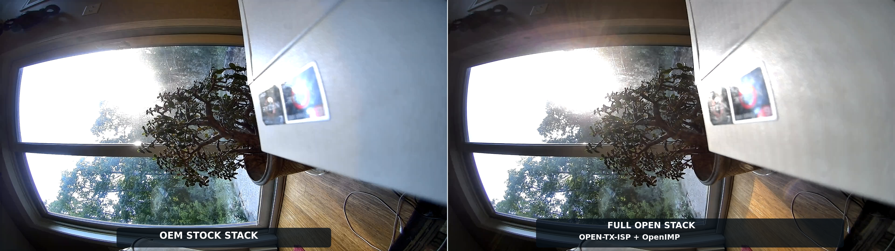

# Open-Source TX-ISP Drivers for Ingenic T20, T21, T23, T30, T31, T40, and T41


## Overview

This repository contains open-source reimplementations of the Ingenic TX-ISP
kernel drivers for T20, T21, T23, T30, T31, T40, and T41 cameras. The active
cross-SoC work includes device-tested T23, T30, T31, T40, and T41 drivers plus
the static T20 and T21 recovery baselines. T31 is organized as a modular driver.
T20, T21, T23, T30, T40, and T41 retain large recovered core sources, but their
modules now have separate adapters for shared facilities where applicable.

The project goal is **behavioral equivalence with the OEM driver** while
supporting both Ingenic's unmodified proprietary `libimp.so` and the fully
open [OpenIMP](https://github.com/opensensor/openimp) userspace stack.

This is not a greenfield camera pipeline. It is a reverse-engineering and compatibility effort that combines:

- open-source kernel-driver development
- OEM binary analysis
- `libimp.so` ABI compatibility work
- image-quality tuning and calibration recovery

## T31 / SC301IOT Image-Quality Checkpoint



[Download the 4:5 portrait version for social sharing.](docs/images/wyze-vdb2-sc301iot-oem-vs-full-open-linkedin.png)

This is a current, same-scene A/B from a Wyze Video Doorbell v2 using the T31X
SoC and SC301IOT sensor. The frames were captured 98 seconds apart on August
15, 2026:

- **Left:** OEM TX-ISP driver with OEM `libimp.so`
- **Right:** Open TX-ISP at `a103ec61` with OpenIMP at `7c6ca71`

Both stacks produced a stable 1920x1080 stream through the same Raptor
userspace. The full-open result is now close to the OEM daylight rendering;
the remaining visible difference in this scene is primarily exposure/color
response around the sunlit foreground and deep plant shadows. This checkpoint
is deliberately scoped to this camera, sensor, mode, and lighting condition.

## Current Status

The project has moved beyond basic probe and stream bring-up. T31/SC301IOT is
the strongest validated path and now has a working fully open capture stack,
OEM-like daylight image quality, and persistent runtime flip control.

| SoC | Current validation |
|---|---|
| T20 | Recovered whole-driver baseline clean-builds and links against the vendor Linux 3.10.14 tree; the structural binary audit reports no stub or collapsed findings, but device-load and streaming validation are pending. |
| T21 | First recovered whole-driver baseline is integrated and builds against the vendor Linux 3.10.14 tree; stock T21/T23/T31 comparison backs the shared math adapter and two IRQ collapse repairs, but hardware validation is pending. |
| T23 | Device-tested vendor-kernel path with live capture and shared registry, layout, ABI, and tuning primitives; broader sensor and image-quality validation continues. |
| T30 | Device-tested on a T30X Wyze Video Doorbell v1 with SC4236: open ISP frames, firmware IRQ/statistics, tuning-derived AE/color, and balanced exposure allocation are live; anti-flicker/shutter allocation remains under active comparison with stock. |
| T31 | Device-tested with SC2336, GC2053, and SC301IOT on vendor Linux 3.10 and compatibility-tested on mainline Linux 7.1; OEM `libimp.so` and OpenIMP both stream, with near-OEM daylight parity demonstrated on SC301IOT. |
| T40 | Device-tested on T40XP/GC4653 with processed streaming, userspace AE/AWB, denoise/tuning recovery, and stock/open register comparisons; statistics restart stability remains a known limitation. |
| T41 | Device-tested 2.5K open-stack baseline plus V4L2 MMAP and DMA-BUF capture; image-quality and delivered-FPS work remain active. |

### Working today

- kernel module architecture is in place
- the T20 recovery baseline clean-builds and links with tracked SDK sources,
  shared sensor/math adapters, and a structural binary audit with no stub or
  collapsed findings
- the T21 recovery baseline builds and links with a stock-backed shared math
  adapter, current binary audit, and restored public IRQ callback paths
- the T30 recovery builds, links, and has produced live SC4236 output through
  the real T30X consumer; compressed histogram AE, tuning target correction,
  balanced exposure partitioning, and userspace 50/60 Hz control are active
- major ISP subdevices exist and probe
- core MMIO mapping and IRQ ownership are understood
- stream bring-up is functional enough for live video
- tuning infrastructure and many ISP blocks are implemented
- the T31 driver has live sensor coverage on SC2336, GC2053, and SC301IOT;
  three separate SC301IOT doorbells were exercised in the fleet archive
- the T31/SC301IOT pipeline streams with either OEM `libimp.so` or OpenIMP
- T31 daylight color and lens-shading behavior on the Wyze Video Doorbell v2
  are close to the current OEM reference
- T31 GIB, DMSC, LSC, ADR, AE-statistics preservation, and runtime register
  sequencing have been aligned with observed OEM behavior on SC301IOT
- T31 H/V flip controls now update the real MSCA output-arbitration register
  while preserving channel-enable bits
- T31 builds on both the vendor 3.10 kernel and the mainline Linux 7.1
  compatibility path
- common interpolation/fixed-point primitives are used by T20, T21, T23, T30, T31, and T41
- T30's pair/scaled/equidistant modulation and legacy Apical scalar math use
  host-tested common primitives behind an SDK-compatible adapter
- T23, T31, and T41 share one typed sensor-registry implementation
- T31 and T41 share a configurable frame-boundary day/night state machine
- T23 and T31 share ordered register-profile and bypass-mask primitives
- T23 and T31 share validated ordered callback plans for tuning sequences
- T23, T31, and T41 share checked proprietary tuning wire layouts, response
  packers, and scalar-versus-pointer command descriptors
- T23, T31, and T41 share overflow-checked NV12 stride, private aggregate-line,
  UV-offset, and sizeimage calculation while retaining per-SoC alignment
  policy
- T23 and T31 share checked MDNS working/reference/UV/tiny-plane layout while
  retaining their distinct allocation ABIs and register ownership
- T23, T31, and T41 share checked NV12 DMA binding, including allocation
  length, complete 32-bit address-range, and Y/UV plane validation before QBUF
  reaches hardware
- the private frame-channel and future public V4L2 adapters now share an
  allocation-free queue core for buffer ownership, completion ordering,
  sequence/timestamp metadata, errors, and deterministic STREAMOFF recovery
- T23, T30, T31, and T41 share the proven frame-channel event namespace and exact
  legacy-`V`/T41-`T` private ioctl envelopes without conflating the
  generation-specific events above buffer completion; the common contract
  also owns the fixed 20-byte request-buffer wire object and legacy stream
  command IDs
- T23, T30, T31, T40, and T41 share checked 32-bit pad and active-link offsets,
  including the event callback slot used for remote frame-channel dispatch
- T31 applies evidence-backed SC2336 day/night DMSC correction profiles
- T20, T21, T23, T30, T40, and T41 link recovered cores with logical shared-library
  adapter objects
- reverse-engineered architecture and tuning docs now exist in-tree

### Still incomplete

- the T31/SC301IOT daylight result is not a claim of universal OEM parity
- night/IR, WDR, extreme exposure, and additional sensor combinations still
  need comparable OEM-versus-open validation
- some tuning tables on other sensors and SoCs remain synthetic or only
  partially reconstructed
- several ISP blocks still need broader parity testing or better OEM-derived
  calibration data
- OpenIMP streaming quality, rate control, and long-duration stability need a
  wider device matrix even though the current T31 path is functional

If you want the detailed status and finish plan, start with `docs/IMAGE_TUNING_PRD.md`.

## Key Documentation

- [`docs/T31_ISP_ARCHITECTURE.md`](docs/T31_ISP_ARCHITECTURE.md) — current hardware / driver architecture notes
- [`docs/ISP_SOC_ALGORITHM_VARIANCE.md`](docs/ISP_SOC_ALGORITHM_VARIANCE.md) — proven T23/T30/T31/T40/T41 algorithm differences, hardware boundaries, and unification hypotheses; T20/T21 source recoveries remain outside the device-proven matrices
- [`driver/t20/README.md`](driver/t20/README.md) — T20 recovery provenance, source partition, binary audit, and hardware-validation boundary
- [`driver/t21/COMPARATIVE_ANALYSIS.md`](driver/t21/COMPARATIVE_ANALYSIS.md) — stock T21/T23/T31 overlap, extraction decisions, and next repair queue
- [`docs/DRIVER_REUSE_PLAN.md`](docs/DRIVER_REUSE_PLAN.md) — cross-SoC commonality map and staged reuse plan
- [`docs/SHARED_DRIVER_LIBRARY.md`](docs/SHARED_DRIVER_LIBRARY.md) — landed shared interfaces, adapters, invariants, and device matrix
- [`driver/t31/README.md`](driver/t31/README.md) — T31 file ownership, validated SC2336 state, tuning ABI, and known gaps
- [`docs/IMAGE_TUNING_PRD.md`](docs/IMAGE_TUNING_PRD.md) — plan for finishing image tuning and remaining work
- [`docs/ISP_PERFORMANCE_BENCHMARK.md`](docs/ISP_PERFORMANCE_BENCHMARK.md) — reproducible on-device CPU, memory, throughput, IRQ, and module-size baseline
- [`docs/T41_OPEN_PERFORMANCE_BASELINE_20260806.md`](docs/T41_OPEN_PERFORMANCE_BASELINE_20260806.md) — first 2.5K open-stack T41 baseline and configured-versus-delivered FPS finding
- [`docs/V4L2_CAPTURE_PATH.md`](docs/V4L2_CAPTURE_PATH.md) — additive V4L2 capture architecture, landed queue core, and adapter phases
- [`driver/t31/REGMAP_ADR_YDNS.md`](driver/t31/REGMAP_ADR_YDNS.md) — ADR / YDNS register-map notes
- [`driver/t31/TX_ISP_VIDEO_S_STREAM_VERIFIED.md`](driver/t31/TX_ISP_VIDEO_S_STREAM_VERIFIED.md) — stream-control verification notes

## Repository Layout

| Path | Purpose |
|---|---|
| `driver/` | Per-SoC open-source ISP kernel-driver implementations |
| `driver/include/tx_isp/` | Reviewed cross-SoC interfaces and primitives |
| `driver/common/` | Shared kernel implementation with explicit SoC adapters |
| `driver/t20/` | T20 recovered whole-driver baseline, SDK partition, shared adapters, and binary audit |
| `driver/t21/` | T21 recovered whole-driver baseline, math adapter, and binary audit |
| `driver/t23/` | T23 recovered driver and tuning data |
| `driver/t30/` | T30 recovered whole-driver baseline and binary audits |
| `driver/t31/` | T31 ISP kernel-driver implementation |
| `driver/t31/include/` | T31-local headers and data structures |
| `driver/t40/` | T40 recovered driver, shared-library adapters, and tuning data |
| `driver/t41/` | T41 recovered driver and tuning data |
| `external/ingenic-sdk/` | Sensor and SDK reference material |
| `docs/` | High-level project documentation and planning |
| `OEM-tx-isp-t31.ko` | OEM reference kernel module |

Important driver files:

- `driver/common/tx_isp_sinfo.c` — shared sensor registry and procfs lifecycle
- `driver/common/tx_isp_daynight.c` — configurable day/night transition shell
- `driver/common/tx_isp_callback_plan.c` — validated ordered callback execution
- `driver/common/tx_isp_reg_profile.c` — ordered register profiles and bypass-mask merge
- `driver/common/tx_isp_tuning_abi.c` — checked libimp envelopes, reply packers, and command descriptors
- `driver/common/tx_isp_frame_layout.c` — checked NV12 and T23/T31 MDNS geometry
- `driver/common/tx_isp_subdev.c` — checked graph endpoint resolution and
  generation-neutral pad-link validation, initialization, and connection
- `driver/common/tx_isp_remote_event.c` — checked pad-to-remote-handler route
  resolution shared by the recovered T23, T40, and T41 dispatchers
- `driver/common/tx_isp_state.c` — value-level recovered subdevice readiness
  policy with generation-local field adapters
- `driver/include/tx_isp/tx_isp_math.h` — shared fixed-point/interpolation primitives
- `driver/include/tx_isp/tx_isp_modulation.h` — shared Apical pair and equidistant modulation primitives
- `driver/include/tx_isp/tx_isp_sinfo.h` — typed registry configuration and lifecycle interface
- `driver/include/tx_isp/tx_isp_subdev.h` — graph wire records, resolver
  interface, and shared link-state operations
- `driver/include/tx_isp/tx_isp_remote_event.h` — remote-event adapter,
  resolved-target, and failure-status contract
- `driver/include/tx_isp/tx_isp_state.h` — layout-independent subdevice state
  evaluation interface
- `driver/include/tx_isp/tx_isp_tuning_abi.h` — generation-aware proprietary control wire ABI
- `driver/include/tx_isp/tx_isp_frame_abi.h` — exact 32-bit frame-buffer wire layout and generation-aware state flags
- `driver/include/tx_isp/tx_isp_frame_channel.h` — shared frame-channel event IDs, generation-qualified ioctl envelopes, and ioctl decoders
- `driver/include/tx_isp/tx_isp_frame_format.h` — compiler-independent 112/116-byte frame-image format ABI
- `driver/include/tx_isp/tx_isp_frame_layout.h` — alignment-parametric NV12 and MDNS layout interface
- `driver/t20/tx_isp_t20_firmware.c`, `sdk/`, and adapter objects — T20 whole-driver recovery baseline with reviewed SDK replacements and shared sensor/math facilities
- `driver/t21/tx_isp_t21_recovered.c` and `tx_isp_t21_math.c` — T21 whole-driver recovery baseline with stock-backed shared math entry points
- `driver/t23/tx_isp_t23_core.c` and adapter objects — T23 recovered core with shared math, registry, and register-profile facilities
- `driver/t30/tx_isp_t30_recovered.c` and adapter objects — T30 whole-driver
  recovery baseline with shared math, frame ABI, registry, and subdevice facilities
- `driver/t31/tx_isp_module.c` — module init/exit, platform resources, shared register helpers
- `driver/t31/tx_isp_core.c` — core probe, memory mappings, ISR path, first-frame logic
- `driver/t31/tx_isp_tuning.c` — tuning subsystem, per-block init, parameter handling, image pipeline control
- `driver/t31/tx_isp_csi.c` / `driver/t31/tx_isp_vic.c` / `driver/t31/tx_isp_vin.c` / `driver/t31/tx_isp_fs.c` — CSI/VIC/VIN/frame-source subdevices
- `driver/t40/tx_isp_t40_recovered.c` and adapter objects — T40 recovered core
  with shared subdevice graph, remote-event, link-state, and readiness policy
- `driver/t41/tx_isp_t41_recovered.c` and adapter objects — T41 recovered core with shared day/night, math, and registry facilities

## Project Goals

1. Replace the proprietary TX-ISP kernel drivers on supported T20/T21/T23/T30/T31/T40/T41 devices
2. Preserve compatibility with Ingenic's `libimp.so`
3. Support a fully open kernel-and-userspace path with OpenIMP
4. Match OEM register sequencing and control behavior closely
5. Recover or reconstruct enough OEM tuning content for acceptable image quality
6. Document the hardware and bring-up process so the work is maintainable

## Requirements

- **Active target SoCs:** Ingenic T20, T21, T23, T30, T31, T40, and T41
- **Kernel focus:** Linux 3.10.14 vendor trees (T20/T21/T23/T30/T31), Linux 4.4.94
  vendor trees (T40/T41), and the active T31 mainline compatibility path
- **Userspace ABI targets:** Ingenic `libimp.so` and OpenIMP
- **Sensor support model:** OEM-style sensor drivers and compatible sensor integrations from the Ingenic SDK ecosystem

## Build

The local build helper selects a per-SoC driver with `SOC`:

```bash
SOC=t20 ./build_local.sh
SOC=t21 ./build_local.sh
SOC=t23 ./build_local.sh
SOC=t30 ./build_local.sh
SOC=t31 ./build_local.sh
SOC=t40 ./build_local.sh
SOC=t41 ./build_local.sh
```

`ROOT`, `KDIR`, and `CROSS` can be supplied for the matching vendor kernel and
toolchain. See the comments in `build_local.sh` for details.

Host-side tests for shared, kernel-independent primitives run with:

```bash
make -C tests check
```

## Reverse-Engineering Workflow

The project works best when changes are driven by evidence, not guesswork.

Recommended workflow:

1. identify the relevant open-source code path in `driver/`
2. compare against the OEM binary behavior
3. confirm `libimp.so` expectations when ioctl or struct ABI is involved
4. make the smallest safe parity change
5. validate with logs, images, and targeted diffs

The new architecture and PRD docs capture the current high-level understanding so this work can continue systematically instead of rediscovering the same facts.

## What Makes This Hard

This project is solving several problems at once:

- hardware bring-up and clock/reset ordering
- platform/subdevice modeling
- reverse-engineering OEM register sequences
- reproducing runtime tuning behavior
- recovering missing calibration/tuning tables

Even when streaming works, image quality can still be wrong if one of the following is off:

- CFA/demosaic phase
- block enable/bypass state
- LUT programming path
- tuning table contents
- day/night or WDR bank selection

## Limitations

Current limitations are mostly in **coverage and repeatable parity across
sensors, modes, and lighting**, not basic driver existence. The T31/SC301IOT
daylight checkpoint above is the first full-open path to reach near-OEM image
quality.

Known classes of remaining work include:

- remaining color/exposure differences under difficult mixed and backlit light
- OEM-calibrated table recovery for additional sensors and denoise/WDR banks
- mode-complete validation for day/night, IR, WDR, and sensor flip combinations
- long-duration full-open streaming and encoder-quality validation across the
  supported SoCs

## Contributing

Contributions are welcome, especially when they are grounded in one of these:

- OEM binary analysis
- `libimp.so` ABI validation
- concrete hardware validation logs/captures
- recovery of tuning/calibration data
- improvements to documentation and reproducibility

If you are making behavioral changes, please document:

- what OEM evidence supports the change
- which files/functions were updated
- how the change was validated
- any remaining uncertainty

## Acknowledgments

Thanks to the work and prior art from the broader Ingenic / Thingino / Wyze reverse-engineering community, especially:

- [thingino-firmware](https://github.com/themactep/thingino-firmware)
- [ingenic-sdk](https://github.com/themactep/ingenic-sdk)
- [OpenIMP](https://github.com/opensensor/openimp)

## License

This project is licensed under the GNU General Public License (GPLv3).
